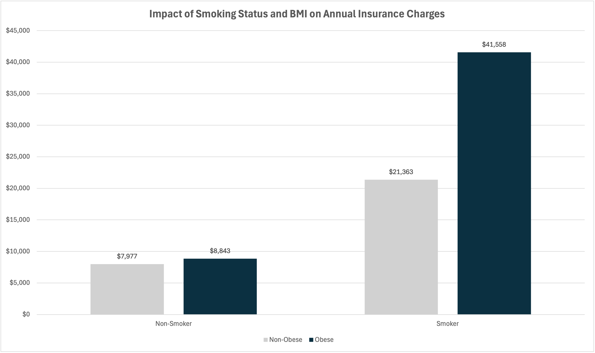

# Medical Insurance Risk & Premium Variance Audit

## 📋 Project Overview
This analysis audits a medical insurance portfolio of 1,300+ records to identify high-risk policyholder segments. By leveraging **SQL**, I isolated lifestyle and demographic factors that drive disproportionate financial liability.

## 📊 Key Findings: The "Risk Staircase"
The analysis reveals a compounding effect between tobacco use and Body Mass Index (BMI). While smoking is the primary cost driver, obesity acts as a significant financial multiplier.



### **Executive Summary**
* **The 'Smoker Penalty':** Tobacco use increases average premiums by approximately 280%.
* **Compounded Risk:** 'Obese Smokers' (BMI 30+) represent the highest fiscal risk, with average charges of **$41,558**—nearly double that of non-obese smokers.
* **Baseline Comparison:** Non-smokers remain the lowest risk tier, with costs staying relatively stable regardless of BMI.

## 💻 Technical Implementation
* **Language:** SQL (MySQL)
* **Techniques:** Conditional Logic (CASE statements), Data Aggregation (AVG, ROUND), Multi-factor Grouping.
* **Toolstack:** MySQL Workbench, Excel (Visualization).

### Featured SQL Query
```sql
SELECT 
    smoker,
    CASE WHEN bmi >= 30 THEN 'Obese' ELSE 'Non-Obese' END AS bmi_category,
    ROUND(AVG(charges), 2) AS avg_charges
FROM insurance_premiums
GROUP BY smoker, bmi_category
ORDER BY avg_charges ASC;
